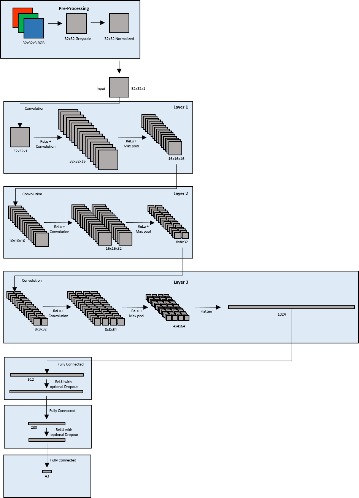

## Traffic Sign Recognition

### Project #3 for Udacity Self-Driving Car Nanodegree
The goals / steps of this project are the following:

* Load the data set
* Explore, summarize and visualize the data set
* Augment the training data set 
* Design, train and test a model architecture
* Use the model to make predictions on new images
* Analyze the softmax probabilities of the new images

#### Load data set
Number of training examples = 34799
Number of testing examples = 12630
Image data shape = (32, 32, 3)
Number of classes = 43

#### Visualize the data
Augment the training data set by rotating and moving exist images

#### Normalize and Augment the training data set 
the image data should be normalized so that the data has mean zero and equal variance. So I use *standard deviation* 

±10 degree rotation
3 pixel movement

#### Train and test a model

Validation Accuracy = 0.962
Test Accuracy = 0.946
#### Predictions on new images

model prediction : [2, 39, 26, 31, 12]
answer     : [2, 39, 26, 31, 12]

Image 1 Accuracy = 1
Image 2 Accuracy = 1
Image 3 Accuracy = 1
Image 4 Accuracy = 1
Image 5 Accuracy = 1
Total Accuracy : 100.0%

