## Traffic Sign Recognition

### Project #3 for Udacity Self-Driving Car Nanodegree
The goals / steps of this project are the following:

* Load the data set
* Explore, summarize and visualize the data set
* Augment the training data set 
* Design, train and test a model architecture
* Use the model to make predictions on new images
* Analyze the softmax probabilities of the new images

#### Load data set
Number of training examples = 34799

Number of testing examples = 12630

Image data shape = (32, 32, 3)

Number of classes = 43

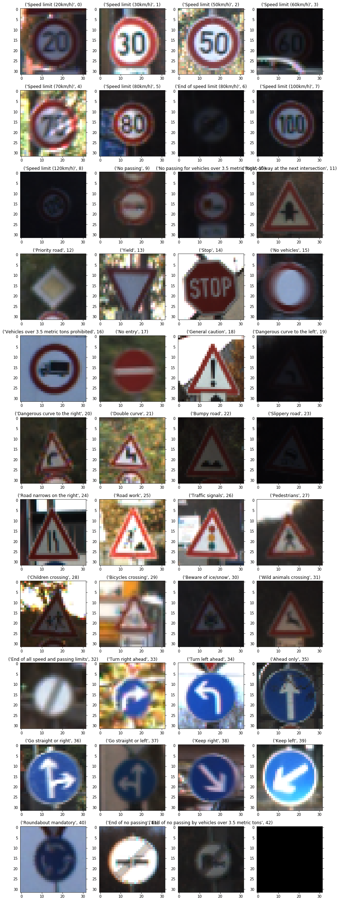

#### Visualize the data

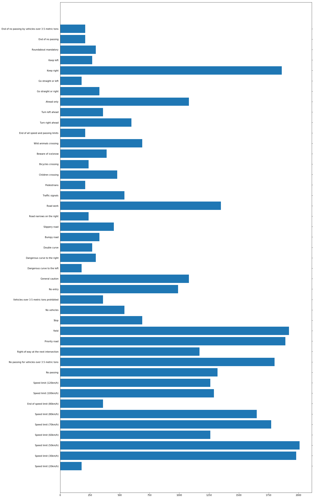

#### Normalize and Augment the training data set 
Augment the training data set by rotating and moving exist images
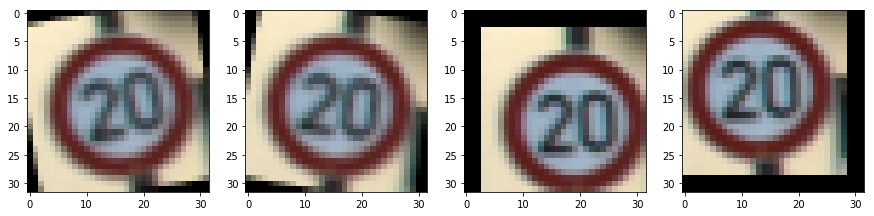

±10 degree rotation
3 pixel movement

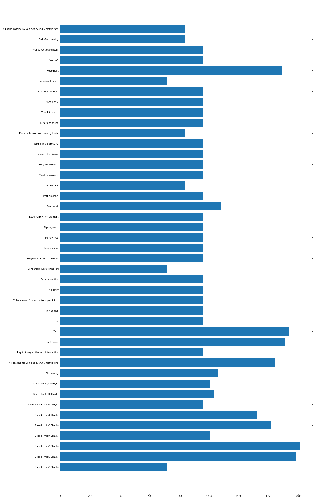

All the images were normalized so that the data has a mean of zero and equal variance. This helps the model converge faster. Since there was an uneven distribution of the number of images for each class as shown in the histogram of the training set images, I added augmented images for some classes such that the minimum number of images in each class is 1200 images. For the augmented images, I applied a transform function which 10 degrees rotates and moves the input image. The total number of training images before & after augmentation were 34799 & 55860 respectively.

#### Train and test a model

I used the VGG_net architecture (shown in image below) as-is since I was getting above 96% training and validation accuracy using this model after preprocessing and augmentation of the input training set. 

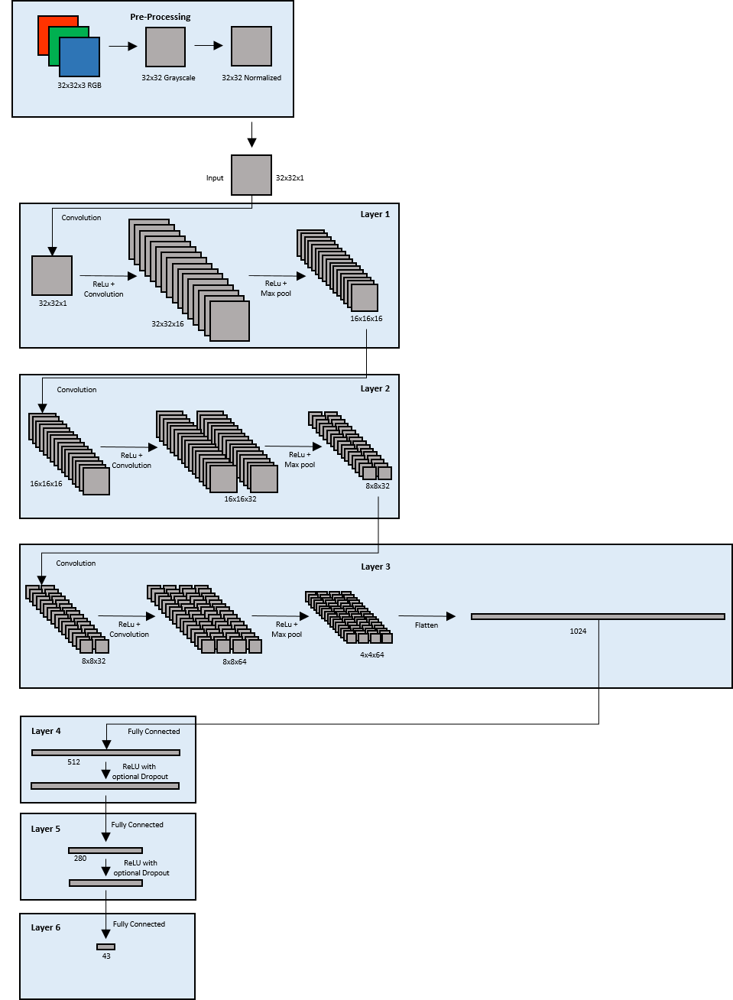

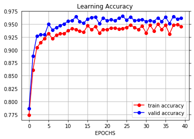

Validation Accuracy = 0.962

Test Accuracy = 0.946

To train the model, I used the following hyperparameters after some experimentation with image preprocessing & the number of augmented images, number of epochs, and dropout rates. Eventually, I settled on the following hyperparameters: EPOCHS = 40, BATCH_SIZE = 128, learning rate = 0.001, dropout = 0.7. I used dropout on the fully connected layers. My final validation accuracy is 96.2%, and test set accuracy is 94.6%. I also used the Adam optimizer which helps the model converge faster, although it requires more computing resources.

#### Predictions on new images

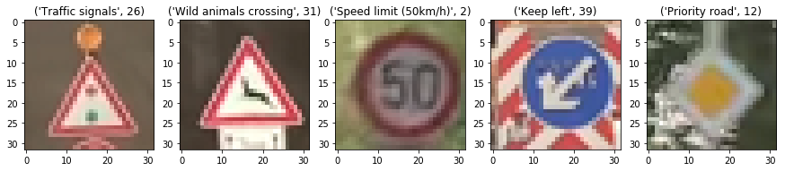

model prediction : [2, 39, 26, 31, 12]

answer     : [2, 39, 26, 31, 12]

Image 1 Accuracy = 1

Image 2 Accuracy = 1

Image 3 Accuracy = 1

Image 4 Accuracy = 1

Image 5 Accuracy = 1

Total Accuracy : 100.0%

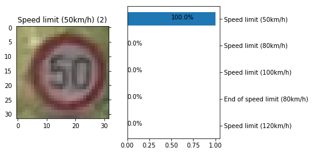
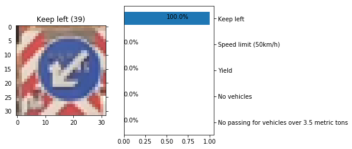
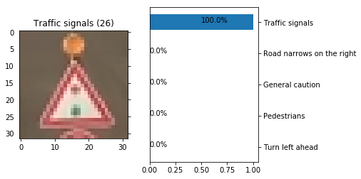
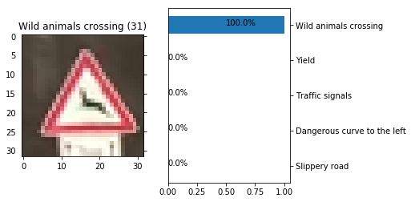
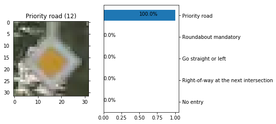

